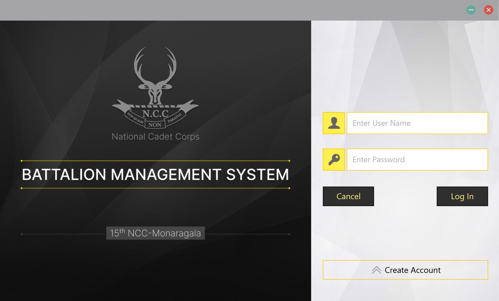
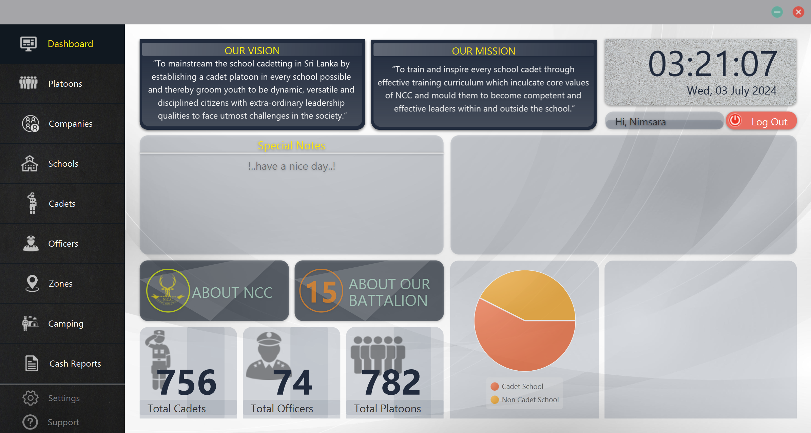
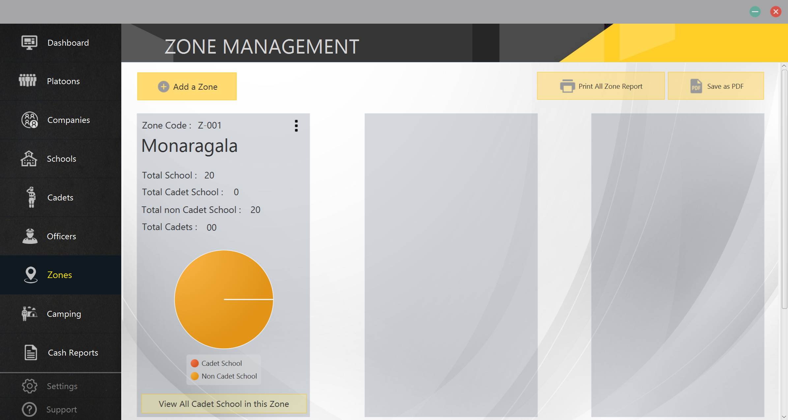

# Sri Lanka Cadet Corps Battalion Management System

- This is a simple web application that is developed to manage the battalion of the Sri Lanka Cadet Corps. 
- This application is developed using Java,JavaFx and MySQL.
- Application includes features to manage cadets, officers, platoons, schools, companies, battalions, camps, zones, settings and reports.

## Installation

1. Clone the repository
2. Open the project in IntelliJ IDEA
3. Setup libraries in lib folder
4. Create a database in MySQL using the `CadetDbScript.sql` file
5. Change the database configurations in the `src/db/DbConnection.java` file
6. Run the project

## Here are some screenshots of the application

### Login Screen

### Dashboard

### Zone Management

